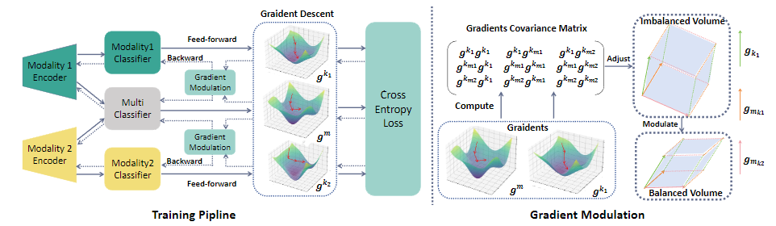
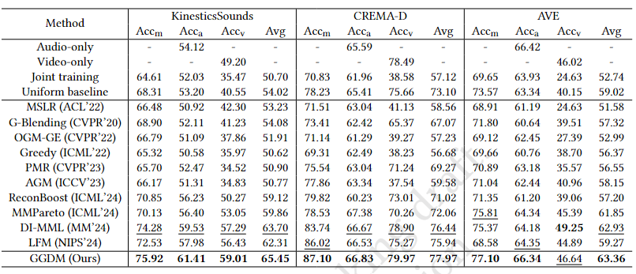

# GGDM
## Method Introduction


An illustration of our proposed method--GGDM, the training pipeline is shown in the left part, in which we use the stochastic gradient descent to update the parameters of each modality encoder. While our gradient modulation module lies in the right part, through our gradient modulation, we can force the gradient polyhedron to shrink to the suitable volume to mitigate the imbalanced multimodal learning.

## Experimental Results


we made comparison with the recent counterparts on CREMA-D, AVE and KinesticSound multimodal datasets.
## Usage
### Prerequisites
- Python 3.8
- PyTorch 1.9.0
- CUDA 11.4

### Datasets
Change the KinesticSound dataset path of ''KS_dataset'' file  in ''dataset'' folder. You can download the dataset through the following url: [KinesticSound](https://github.com/cvdfoundation/kinetics-dataset)

### Training
In order to train the model, you can use  
```python
python run_ks.py
 ```
in the terminal.
